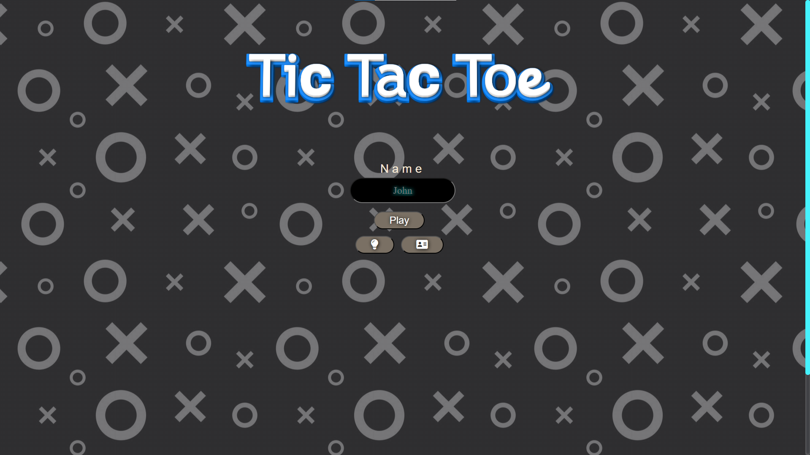
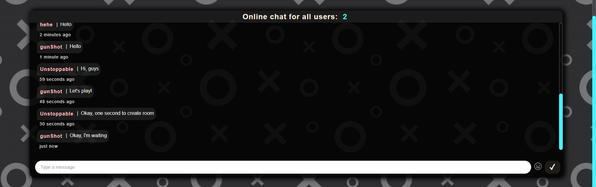
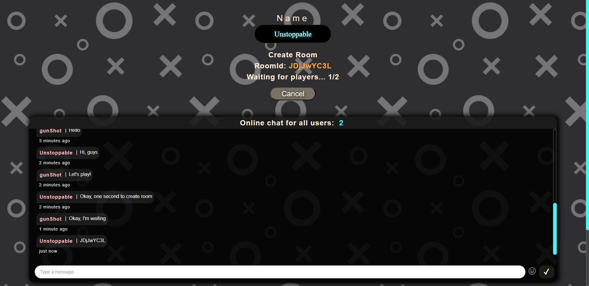
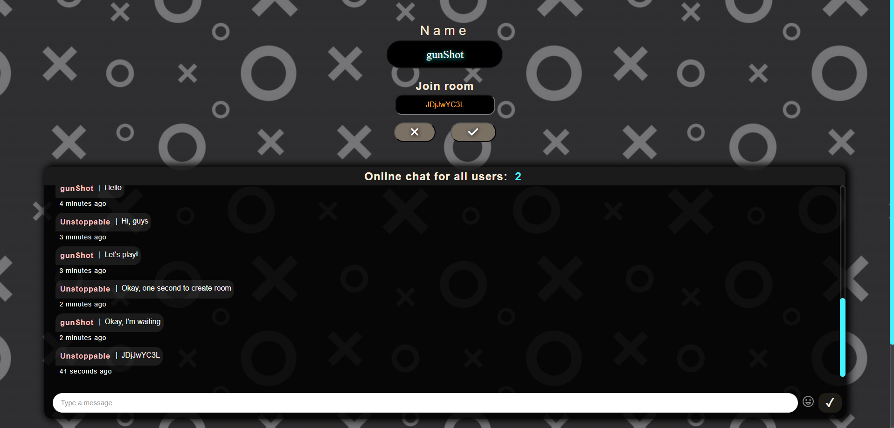
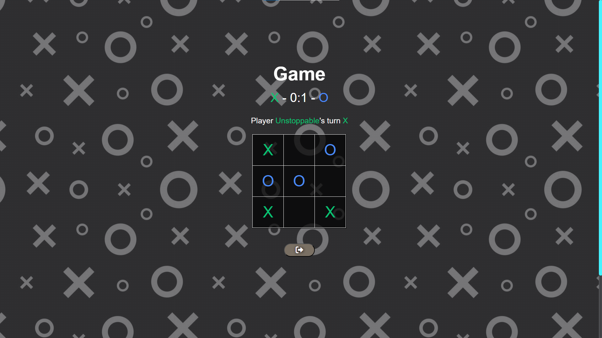
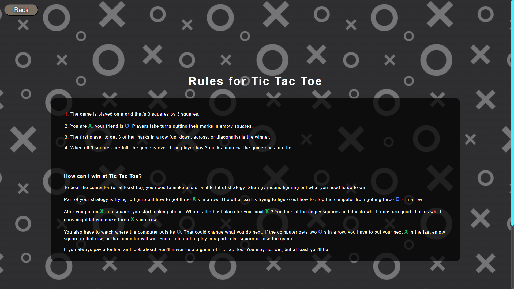
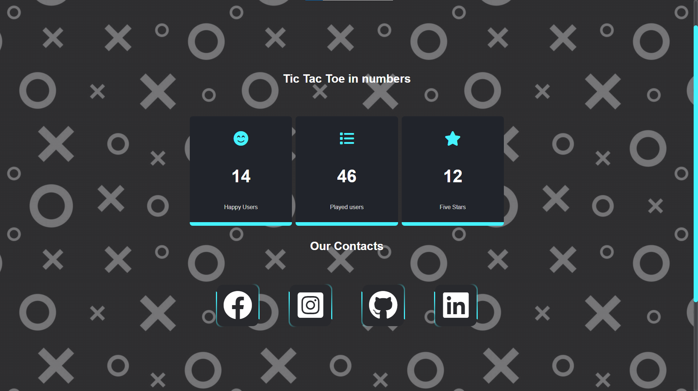

# Tic-Tac-Toe Online API Documentation
This is the API documentation where you will be able to find information on all information about the "*Tic-Tac-Toe Online*" project.

## Used dependencies:
- react
- react-dom
- react-router-dom
- react-input-emoji
- awesome-snackbar
- socket.io-client
- timeago.js
- uuid

### Instalation and start client in client folder:

### To install all dependencies
```bash
npm i
```

### To start application
```bash
npm start
```

## [Backend API Documentation](./server/serverDocumentation.md)

# Introduction
This is a classic Tic Tac Toe online game with three options to play - Create own, Join with code and random room. There is a chat for easier communication with others and to make experience even better. With interactive design and easy way to join!

### Different pages
  - Welcome
  - Rules
  - About
  - Game
  
# How it works

- [x] **Welcome (guest)**

Every ```guest``` can see a Welcome page with login section and three buttons - Login, Rules and About.



- [x] **Welcome (user)**

Every ```user``` can see a Welcome page with different buttons like Create, Join and Random room and again rules, about and button for leave. From below there is a chat for communication.


```Chat```



```Rooms Statistic```


```Create Room```



```Join Room```



```Random Room```


```Game```



- [x] **Rules**



- [x] **About**

On this page you can see information about creator, links for ```Github```, ```Linkedin```, ```Facebook```, ```Instagram```



```Footer```


## END

